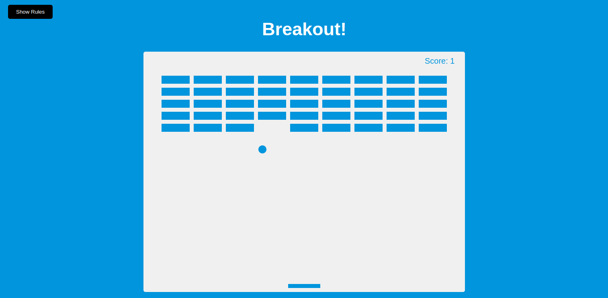

# Breakout Game

A simple Breakout game built with HTML5 Canvas, JavaScript, and CSS. Use your keyboard to move the paddle, bounce the ball, and break the bricks.

## 🚀 Features
- Interactive gameplay with ball physics.
- Paddle movement using arrow keys.
- Brick-breaking mechanics with score tracking.
- Reset functionality when losing.
- Rule overlay for game instructions.

## 📷 Screenshot


## 🛠️ Installation
1. Clone the repository:
   ```bash
   git clone https://github.com/bhramarambha8660/breakout-game.git
   ```
2. Navigate to the project folder:
   ```bash
   cd breakout-game
   ```
3. Open `index.html` in your browser.

## 🎮 How to Play
- Move the paddle left and right using the arrow keys.
- Bounce the ball off the paddle to break bricks.
- If the ball touches the bottom of the screen, the game resets.
- Destroy all bricks to win!

## 🏗️ Technologies Used
- HTML5 Canvas
- JavaScript
- CSS

## 📜 License
This project is open-source and available under the [MIT License](LICENSE).

---

### 🔗 Connect
For any issues or contributions, feel free to open an issue or a pull request on GitHub!

